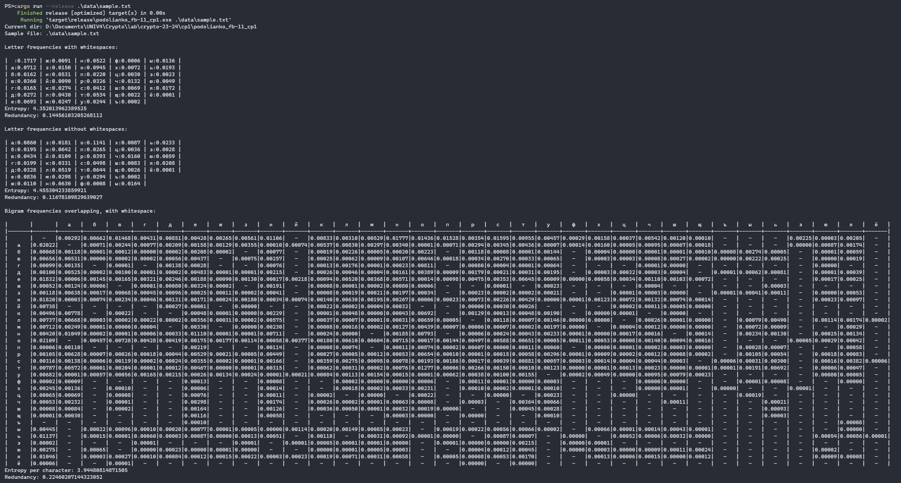
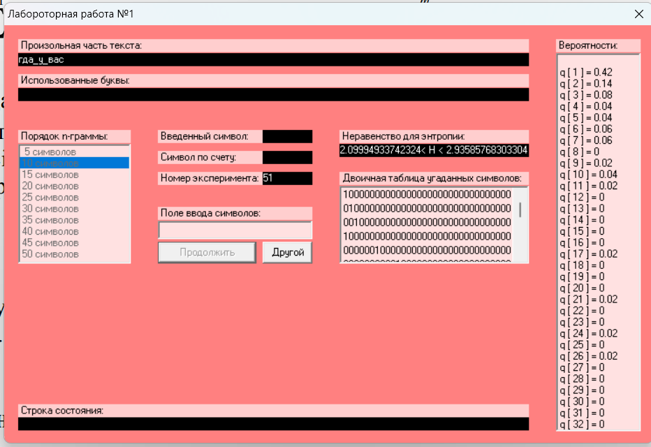
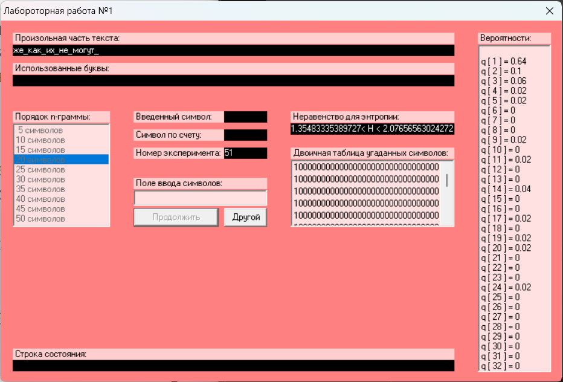
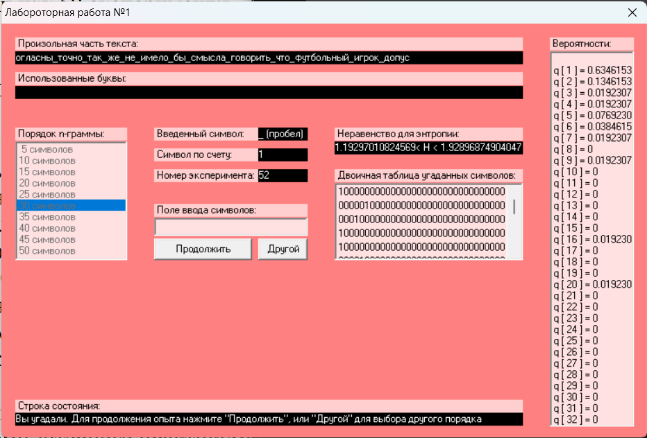

# КРИПТОГРАФІЯ
## КОМП’ЮТЕРНИЙ ПРАКТИКУМ №1
### Експериментальна оцінка ентропії на символ джерела відкритого тексту

##### ФБ-11 Подолянко Тимофій

#### Визначення H1 H2

Реалізовано програму, яка проводить нормалізацію тексту (видалення символів, що не належать алфавіту; видалення подвійних пробілів; зміна регістру) та обчислює ентропію букв алфавіту та ентропію на символ біграми у тексті за умов, коли:

- біграми не перетинаються
- біграми перетинаються
- пробіл входить до алфавіту
- пробіл не входить до алфавіту

#### Демонстрація роботи програми

#### Оцінка значень H(10), H(20), H(30)

##### Результати оцінки

$$
R=H_{\infty}/H_0 \text{, де }H_{\infty}\text{ — ентропія джерела, або, в нашому випадку, її наближення через умовну ентропію джерела; }
$$

$$
H_0=\log_2{m}\text{, де — кількість символів алфавіту}
$$

Обчислимо $R$ для різних отриманих значень ентропіїї з округленням до третьої цифри після коми.

Для ентропій, обчислених з частот букв та біграм тексту:

- коли пробіл входить до алфавіту ($m=34$):

| | |$R$| 
|:-|-|-|
|$H_1$|$4.352013962389526$|$0.14456103205268112$|
|$H_2$ з перетинами|$3.9448081487150466$|$0.2246020714432304$|
|$H_2$ без перетинів|$3.944643848640013$|$0.22463436653415614$|

- коли пробіл __не__ входить до алфавіту ($m=33$):

| | |$R$|
|:-|-|-|
|$H_1$|$4.45530423385992$|$0.1167810982963905$|
|$H_2$ з перетинами|$4.13811270269071$|$0.1796611040342353$|
|$H_2$ без перетинів|$4.136940363004921$|$0.17989350849313612$|

Для умовних ентропій, отриманих за допомогою `CollPinkProgram` ($m=32$):

| | |$R$|
|:-|-|-|
|$H^{(10)}$|$2.09994933742324 < H < 2.93585768303304$|$0.4128284633933921 < R < 0.5800101325153519$|
|$H^{(20)}$|$1.35483335389727 < H < 2.07656563024272$|$0.584686873951456 < R < 0.729033329220546$|
|$H^{(30)}$|$1.19297010824569 < H < 1.92896874904047$|$0.614206250191906 < R < 0.761405978350862$|

#### Висновки

Результати проведених експериментів показують значну надлишковість природної мови ($R_{max} = 0.761405978350862$), однак досягти відповідного (чи хоча б порівняного) ущільнення тексту на практиці дуже складно, оскільки наведене значення надлишковості враховує безліч ваємозв'язків та закономірностей у природній мові.
