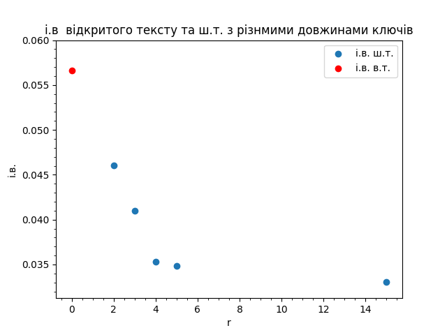
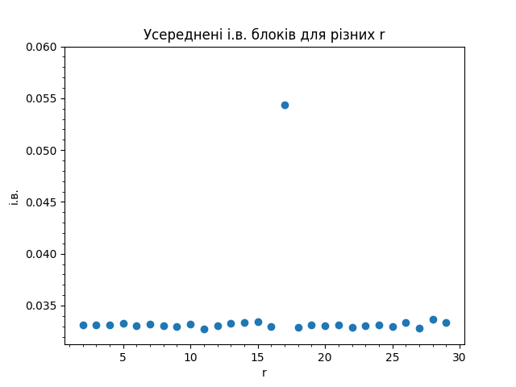
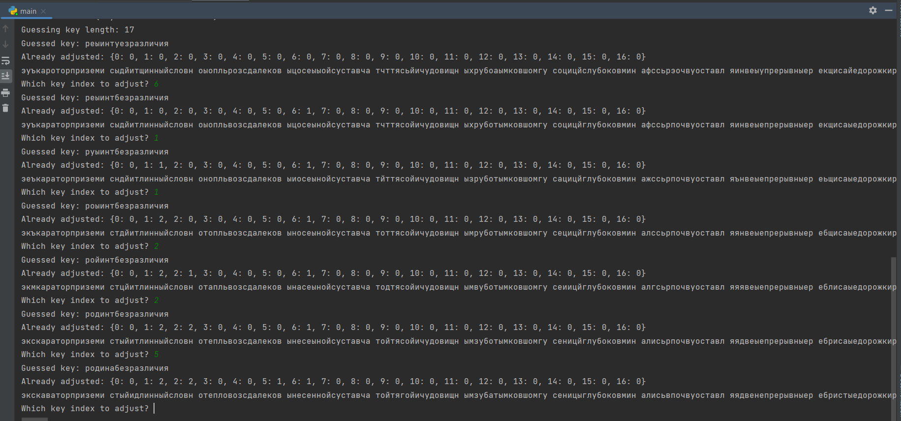

# КРИПТОГРАФІЯ

## КОМП’ЮТЕРНИЙ ПРАКТИКУМ №2

### Криптоаналіз шифру Віженера

###### ФБ-11 Подолянко Тимофій

###### Варіант №13

#### Оцінка значень індексу відповідності для різних довжин ключа

Індекс відповідності для алфавіту рівноймовірних символів довжини 32: 3.125000e-02

Індекс відповідності для деякого великого тексту: 5.592540e-02

Індекс відповідності обраного відкритого тексту: 5.659256e-02

Обраний відкритий текст зашифровано за допомогою шифра Віженера з ключами різної довжини. Розглянуто ключи довжини 2, 3, 4, 5, 15 символів. Індекси відповідності шифротекстів при відповідних довжинах ключів:

| Довжина ключа | Індекс відповідності |
| ------------- | -------------------- |
| 2             | 4.601887e-02         |
| 3             | 4.101897e-02         |
| 4             | 3.528554e-02         |
| 5             | 3.486441e-02         |
| 15            | 3.305327e-02         |

Отримані результати у вигляді діаграми:

#### Встановлення довжини ключа за шифротекстом

Для встановлення довжини ключа для всіх можливих довжин розглядаються розбиття шифротексту на блоки. Для кожного блока у розбитті рахується індекс відповідності, потім береться середнє арифметичне і.в. блока для цього розбиття. Для довжин, кратних істинній довжині ключа, середній і.в. буде наближатися до і.в. відкритого тексту.

Результати аналізу наданого у варіанті №13 шифротексту представлені на діаграмі:

Ймовірна довжина ключа: 17. 

#### Відновлення ключа шифротексту

ШТ розбивається на блоки для ймовірної довжини ключа і до кожного блоку ШТ застосовується частотний аналіз афінного шифру (зокрема, в даному випадку — Цезаря). Відповідність частот реального тексту теоретичним не гарантована, тому доведеться перебирати наступні за імовірністю літери, можливо, для кожного символа ключа.

Демонстрація процесу відновлення ключа за допомогою створеної програми:

Знайдений ключ: родинабезразличия

#### Розшифрування тексту

Знайдений ключ: родинабезразличия

экскаваторприземистыйидлинныйсловнотепловозсдалековынесеннойсуставчатойтягойичудовищнымзубатымковшомгусеницыглубоковминалисьвпочвуоставляядвенепрерывныеребристыедорожкиразящеесоляройлязгающееоноперлонеразбираядорогииготовобылосокрушитьвсенасвоемпутионочудищегенералприроскместуневсилахпошевелитьсяеслиэтоконтрольныйсюрпризтовесемирочченьвысокогообудущемведьмакемненияапотомстрахизамешательствонеожиданносхлынулиосталосьтолькоспокойствиеиглубокаяуверенностьразумведьмакапустьдажеиначинающеговсеравногибчеибыстреетупыхинстинктовдикоймашиныпобедитьбесхитростнуюмощьможноибезоружияоднойлишьсилоймыслиеслизнаешькакгенералзналпокатольковтеорииноведьвтомисостоитсмыслконтрольныхполевыхзаданийвпривязкетеоретическихзнанийкреальнойобстановкеодновременномелькнулашальнаяивданныймоментмалоуместнаямыслишкавотзачемустроилииспытаниевпустоминенаселенномпаркетакойэкскаваторнагородскихулицахстолькобывсегопорушилзадесятьлетнеотрослобыитакимеетсякарьерныйгусеничныйэкскаватормоделимоделиачертегознаеткакоймоделимноготоннаялязгающаягромадинаповсейвидимостиоснащенабортовымкомпьютеромсвозможностьюудаленногодоступаидистанционногоуправленияповсейвидимостивышлаизподконтроляиуспеланатворитьлихихделвонэльфвесьокровавленныйваляетсякстатипреттоонапрямонаэльфанадоотвлечьгенералпрекраснозналслабоеместотакихмеханизмовнеповоротливостьползаюттакчточеловекнасвоихдвоихобгонитпоэтомуонсорвалсясместанабегуподхватилстравышмотникипультсиганулчерезнекстатиподвернувшийсякустиобежалэкскаваторслеватотсразузамедлилсяивдругпроворновыпросталполусогнутыйдоселековшсхрустомпереломилосьмолодоедеревцесловноспичкагенералуспелвовремяубратьсянабезопасноерасстояниечудовищеразворачивалосьготовоеринутьсянапрячущегосявподлескеведьмачонкагенералнеутратилхладнокровиянапротивонужепросчиталкудаметнетсясейчасвоонтудазаогромныйстолетнийдубвнесколькообхватовунегоподитакиекорничтоиэкскаваторусходунесворотитьжизньонавсегдасильнеежелезаимоторовивдругугенералапоявилсянежданныйсоюзникмелькнуласредиветвейистволовкоричневозеленаякурточкаиневдалекепоказалсяещеодинэльфодетонбылточнотакжекакинедавнийпациентгенералановотличиеотпервогопребывалвполномздравииисохранностиивдругугенералапоявилсянежданныйсоюзникмелькнуласредиветвейистволовкоричневозеленаякурточкаиневдалекепоказалсяещеодинэльфодетонбылточнотакжекакинедавнийпациентгенералановотличиеотпервогопребывалвполномздравииисохранностипультутебякрикнулонгенералугенералмолчапоказалемучерныйначиненныйэлектроникойбрикетаключтеперьгенералстольжевыразительнопохлопалсебяпокарманукурткиэльфсловноподземлюпровалилсярастворилсянафонелиствыапотомвозникужесовсемрядомвпарешаговвыскользнулиззастволатогосамогодубаэкскаваторгромыхалгусеницамиинатужнолязгалковшомпробираясьсквозьпаркдеревьяжалобнотрещалииломалисьрождаласьноваяпросекаэльфтребовательнопротянулрукуигенералнеколеблясьотдалемупультсключоммедлитьэльфнесобиралсятутжевставилключведваприметнующельнаторцепультараздалсянегромкийщелчокелеслышныйнафонепроизводимогоэкскаваторомшумапальцыэльфазапорхалинадклавиатуройпультивпрямьоченьпоходилнаноутбукстойлишьразницейчтоэкранунегобылсовсемкрохотныйирасполагалсяненаоткиднойкрышкеапряморядомсклавишамикрышкисобственноинебылововсеотвлекиеговластноскомандовалэльфибеззвучноканулвкустычтотоунеговидимонеладилосьгенералпослушнопотрусилпоширокойразмашистойдугеэкскаваторнакакоетовремяпритихотслеживаяегоперемещенияапотомсталгрузноразворачиватьсяподгусеницамизахлюпалоонвъехалвобширнуюотороченнуюмхомлужугенералпользуясьмоментомшмыгнулмонструзакормунаразворотутогоуйдетдовольномноговременисравнительнобыстрогенералотступилкобширнойовальнойполянепочемутоемубыложалкогибнущиеподгусеницамииковшомдеревьявконцеконцовпаркитакаяжечастьгородакакикварталыаведьмакобязанхранитьгородвесьцеликомаполянупустьутюжитподумалонтраванедеревоещевэтомгодуотрастетнеуспелмонстрвыползтикполянкекакоткудатосбокупоказалсядавешнийэльфмелкойвихляющейрысцойонприблизилсякгенералуплоходелосообщилэльфонзаблокировалвсевходныепортынадолезтьвкабинугенералвдумчивошмыгнулносоминичегонесказалдаичтоонмогсказатьатысобственноктопоинтересовалсяэльфведьмакчтолиначинающийуточнилгенералскромнокакойвыходпервыйнесталвратьгенералэльфсаркастическихихикнулвезетжемневпрочемчегоэтояиначепришлосьбыводиночкукстатичтосранавеноромэтотвойприятельнавсякийслучайсправилсягенералкоторыйпультпотерялдаатыневиделлежитрядомсаллеейбезсознанияунеговесьбокразодраняегоаэрозолемспрыснулвашимэльфнахмурилсядавесамаэвыругалсяэльфонможетневыдержатьтвойприятельумиралкогдаянанегонаткнулсяулыбнетсясудьбавыживетсудьбаредкоулыбаетсяэльфамведьменышзапомниэтогенералсмолчалладнослушайменянужнозадуритьэтоймахинеегопоганыенавигационныерецепторыипопастьвкабинутымнепоможешьразужввязалсявэтоделобоюсьтамвкабинеоднойпарырукбудетмалоподеревьямлазатьумеешьумеюпошлиэльфзаткнулбесполезныйпокапультзапоясштановиделовитозашагалкужевыбравшемусянаполянуэкскаваторуотвлекайпоканапомнилонпобегайунегопередмордойтолькосмотриподковшнеугодиугубуркнулгенералкакможнобезразличнеебегатьпередмордойэкскаватораоказалосьнастолькожеутомительнымзанятиемскольинебезопаснымпервоежезабеганиеедванезакончилосьтрагическимонстррезковыпрямилполусогнутыйковшодновременноподавшисьвпередизаделплечогенералатоткубаремполетелвтравусовершенноошарашенныйещевпадениисообразивчтопридетсямолниеносновскакиватьневзираянабольиубиратьсяметровнадвадцатьвсторонусообразилонправильносдвухсекунднойзадержкойвместогдеонприземлилсявпечаталсяковшпохожийнагигантскийжелезныйкулак

#### Висновки

Застосування ймовірнісних та статистичних методів у криптоаналізі дозволяє відновити ключ (частково або повністю, або, принаймні, зменшити необхідну кількість переборів) для шифрів поліалфавітної заміни за наявності достатньо великого шифротексту.
