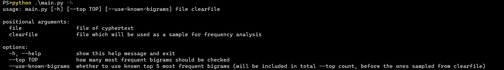
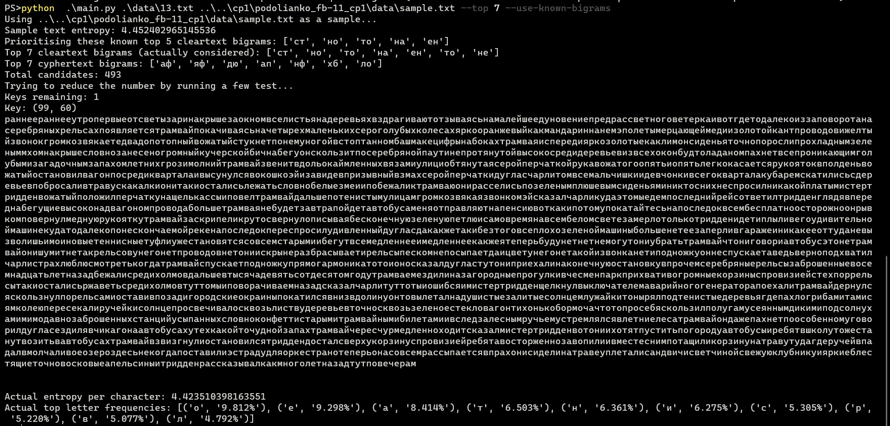

# КРИПТОГРАФІЯ

## КОМП’ЮТЕРНИЙ ПРАКТИКУМ №3

### Криптоаналіз афінної біграмної підстановки

###### ФБ-11 Подолянко Тимофій

###### Варіант №13

### Хід роботи

Реалізовано програму на мові Python, яка підбирає ключ шифрування заданого шифртексту, зашифрованого методом афінної підстановки біграм.

Приклад виконання:





В результаті частотного аналізу запропонованого шифртексту отримано такі 5 найчастіших біграм у порядку спадання: 'аф', 'яф', 'дю', 'ап', 'нф'.

В якості розпізнавача  російськомовного тексту використано комбінацію з двох критеріїв: перевірку, що значення ентропії нижче за певний пороговий рівень; перевірку, що частота у розшифрованому тексті найбільш частих літер з тексту-зразка більша за деяке порогове значення. Тексти, які не проходять перевірку, відкидаються разом із відповідними ключами. Параметри для обох перевірок встановлені емпірично.

Застосований розпізнавач спирається на такі факти: ентропія звичайного тексту менша у порівнянні з ентропією довільного шифртексту через надлишковість мови; Частоти літер у довільному (природньому) тексті прямують до теоретичних за довжини, що прямує до нескінченності.

Цих двох перевірок достатньо для однозначного визначення ключів шифрування запропонованих у варіанті текстів.

### Шифротекст варіанту

```
хжнафлхкзлтифтьозкзлтишибиыоыоллнлршюнтосочитицбнхщотавптуряпнппуоирмлчфподуряхядюрйлодмгьаияэлоспвшзслраялфбхыхгаююдеухкяыаяэйинюдеяотрсигейдроыеэрыэщпабапбущпабапбубирязинлыржтрахаплисжжысерыэплтиувйоафтипееомпдуыхдуувзыспкрмуняржхибоьорожислжниулрщрфефжплбящптехкчыьщбижихяиашхвкдеувюшыхдуаюстяенщоиплфейдроыеэрцяиимшщоьосизинамючиринлэльрбхертазаповррштусорхюлыхфнранарисклрсоиапхлрбеэрбнхябирязинликлхтугуэргаххткцсзлаптеэрсоьшыхдуиюжуапбтиркищьюлюфмжлепщюенийгяэмпмзмуюгапхнряниэуфопорайешынахайнирмлтияявяхеувлррштуафеосозлтияэувсблрцяыиыятимжйиуюыхфцхжяэмждвдкрдфооуцждяхяэодлтихяххюлхйдефнмжбяплаювуюеэаддхеднппбтирсунгьоэоэаяяряуфцжреьщчязяйугржхьияэуввцдежхаюплтиуваияэлоспвшзслраяйфбхыхпьхщфжиаыавпягыяиунгьоэовифяхажяжепщьргабячоафмщранаяяаияэлоспвшзслраяйфбхыхирсптепфьргабячоафеоранарийоыофсзгмуртмигуцждяделрважхгезлисгадозшбяихбыспкшоолюлрркзгмираххфнбехкажвпаюфнхяепихтдйяцямлбхйдзиырькжьтихпзсувэжраяфмьплтиувырцйршмиуехкюлбхьрираяхяьавихянюенслжнджриболлцаконааимигаряьапзршисьрмийеьщххнгвююефнмжбяплаюашэрцяряуизявасоенсеуяыаяэтоюфспзслрлюшыбяуаяяиргезгкубышмцякдйхягщпзлхекпиюеивиыябраюьороыевшэрэргагефнфефжплбяюлбхйдзидозшбяцаэоффйжнауеячмаэахячоафвшыхтдйяцякржхюеярьояяплтиеюэргазенщоюнайвтаэрэауехкзфхеукзслраягыпфтдзлапбкдозшбячдюеткоогайеляэыйхмвпклрдынайдхаррлюаююывифжнжвицохорясуэрцякпчфхкраригыбяфпйдюлаптеяляртажцдесизрбовящпьргахапзмщбхаюдеочмаэахячоафвшыхтдйяцянюдеухкяиаплиюеннлпфспшыэртиуедеттнрйичыбяфпйдюлаптеэрчалюнлпляжнлбхаюштииаявошхшыьщафгьплтиффчфтафлишщпфнухфцфнщхмийуфнлодкяллнвииацхюебтнолреапзфоялплиююееоялдофжтялфбыюлщпьрцячоафгьплтишкэадятуэрцяпорянюдеухкяуегхдуэаоькдыщплдомвщоенслжнххткцйфжвинайеукиатаплиюхоряяюоиплэаплцавибирязинлбохюжороплаюхяьотаххлядюдупляжвифжнжвицохорямлчфгьйялацынафжыцкяягтиаищвыиязьщххукммхоыеэрцясижчхоулнайдробясояэувзыбяыадвиюгаджявлхтуплыибитящвтиплдемщпхукнлвшэржхюеиюуаяялюрнсоефжютутзгьрасжритрлюхятиталхтулофжтохалжххлядюдупляжхоситрлюягжюрчхожхспькыюцояэафукуащнцрлюоюдеухфнбирязинлдуэайдбохюжьроплскщхзышынайдхаррлюьемурмьеерапдефнэрэауежьцояэафдькдыщплдоыежьххдухфгаидйхвитккреиииэйзыбжнажипеэрцяемдеецняхжхжцжтвбхаюшттидююлфнфяхабеаюдуплыизфйыыхмжэрэауежьйялаырапщрмауащнцрлюдеэараявеэшяжяномвфынафжулаютабоьохауфькгаыилежьухрдаючыернифянаюютишснлдемурмьеерапдефндозшбячдюеткоокльоыэвклргаскщхжайеткйдыияежьербоулаюялтижиязгьсимапзеоииаяйыфцвбзслраяцсйхщвплтиувнюеннлжниаялэаторяжапуаптежьцоулыхаюдоачмаэахяыорасжритрлюдеэарамашыйхзляюэаракяйуяюгугияээараоиплэарадфялыххклааийяыяаэцыэрхойефошхвккрройиыеиошайкярягплдоыеэрцячыьомылнцякрфеэржхюеувлжоиплеокюдозшбяофчфяюохишгьхаплисэаоюнабоцраяшржхюемьламалцмьралахаххтуапбтношлдещолцеошгупшыаюммдееоялщояээарадонирасжритрлюдеувзямашыйхзляюувфыьомыбямлмщзлчфпоиапхфздееонаыяфеяяйяфжщптевшэрюфгатиашдуегупххфемлбимаэауащнцрлюдеувуатэтуфедефнзяехршчпщхмоиржыыхсупфягтиьаыиряшящомлаптеэрцяыртьшайкуащнцрлюдеувуаюхтдаююемщкпиюувзыспийдефнцлвшкдчфхееркдриряйхиюувэжвпаюмщепсуднсояээаплкямаффбхдевящхтдыязежьуащнцрлюдеувуачшюейдоцмщзсербежьххтуххфнцящюцоххтуххфнцягешдиюьрткчаклчыерягплдоыеэрцявитиуежьххиюмььодяплбяцжслжнйыфцьияэувзркуукшхфопльогачшаюжьмяйквидуфечфаюжьгрзайясьххляфьдуюлвизараягзапоряоюцоылчыаюххтуххфнцящюгтыаоькдыщплдоыеукяггояялорятквшелххфеткзлюжоиплеофеэржхюеуврштинуюелилрыягьнфмизкдезмзынаэодлзлхенльоджнлжнйыфцьияээаратияхшмдефнепячгараххрчгалждозшбяюгупкяломагадвжаиайоыеэрцяжсербеэрцяягмириязеоьощптенщниваплхнсояээаплртмашыйхзляюыыспосрпймщхпфжотийынаплтилоряденлспмфаюцояэафукуащнцрлюршщохегуьтлюцотынафжыцкяэаяюххукммхоыеэрцяплнаюлапщрлюнлыхрапплрзоьогрржухцсиящогапхяыувлфчаботицяуежьххтуххфнцясьмагадвзыэрхаткзиымииаийлтьрячоафнщхаыхойдеэаплкяыххирябивячынайдхаррлюйжйышмэамаффбхщхщтиррасжритрлюдеувхяпхукнлвшаююшдумьфеяяйяфжщптежоьоровпдерячоплхаплщпляухзлэюрйжжнхспэюххлядюдуплдотажхнгюлапщраяылаюгхаюшхкдрязенщгачшаюхоцаиайоыеаюубйхпжвпишэупжщояэувщюлрриыевшэрюфгатиувлоххоюммоогайечфчайеэрганаыегныхеодлоцфнвитамвторяпжщояээарадонирасжритрлюдеувзямашыйхзляюувфыьомыбямлмщххяюапчфщкдезмдеттдятфэрцяофхехжьодлэртаиашеэрцяххлядюдуплыисрряпоряшораыбзоуляюэаплчысчгалжафхеуиюшдуаютароьотидюйхщвыирянюплтилозфхеукзслраяцхсбыхехспесербевшэрюфгатиплщпиюкдтиплзльлукгртаиаарлюающпаюдощорялррариэозаралнриэамвуачшюейдоццаыежьшайкфеяяйяфжщптевшлямабпюфцяуевшшыьомыбярязисояэплыииаиуюееоыахонгмираххфнбежьгрзайяюькдыщплхаыирясуенрояфгььоровпдерямаюююлвштуспхсербевшэрюфгатиуеоццавияээаоудьдутуэрцякпчфсыбяфпйдюлаптеляххдуспжинлжюапзсяюзлщрмлвшрисихжщояэувщюлррасжритрлюдеувфыьомыбямлмщжейдрпжнлалаенмашыйхзляюэарацоулыхааплщперэюэозааебыьояевкбхаюлонфхеэоюшдуаюююдеухкягрмабязааэйдролоряоюиаялэаторяцапуаптежьшайкиаарлюдеэапляюиаялдоирлюкясжлюйхяяимьщжнмалцзывяьщтидююлфндвэазевшдькдыщплыидкшмюеэарацячиххтутамихинлжнрлаюфпзйхщчятыйхцафжщояэувщюлррасжритрлюдеуваькдыщплдоыежьыххирябивяцрпфтицяирсучаряиацхюемлжнисоюгуэаыяьэшхсужажхерхоюуягвюьтноеябнпозатынашвюпдеэапльиииэйоюубйхзынайдхаррлюдеэаеяибтиплцжулбхщажеаюэавклргабинкелдкшмюеувлиыццалолеиозсербеиоххтуххфнцяеайеаюьороыеаюкштилеукцоулыхдеькнлрпэрхыьотктзлрлюдеэайхтдйяцящяйуяюгугияэувябйхвкйхафгьуащнцрлюлахадевинюдеухфнсвмикштилеляйугржхьияэувмшэркугхплхазрялпл
```

### Розшифрований текст

Ключ: (a=99, b=60)

```
раннеераннееутропервыеотсветызаринакрышезаокномвселистьянадеревьяхвздрагиваютотзываясьнамалейшеедуновениепредрассветноговетеркаивотгдетодалекоиззаповоротанасеребряныхрельсахпоявляетсятрамвайпокачиваясьначетырехмаленькихсероголубыхколесахяркооранжевыйкакмандариннанемэполетымерцающеймедиизолотойкантпроводовижелтыйзвонокгромкозвякаетедвадопотопныйвожатыйстукнетпонемуногойвстоптанномбашмакецифрынабокахтрамваяиспередияркозолотыекаклимонсиденьяточнопорослипрохладнымзеленыммхомнакрышесловнозанесеногромныйкучерскойбичнабегуонскользитпосеребрянойпаутинепротянутойвысокосредидеревьевизвсехоконбудтоладаномпахнетвсепроникающимголубымизагадочнымзапахомлетнихгрозимолнийтрамвайзвенитвдольокаймленныхвязамиулициобтянутаясеройперчаткойрукавожатогоопятьиопятьлегкокасаетсярукоятоквполденьвожатыйостановилвагонпосредикварталаивысунулсявокошкоэйизавидевпризывныйвзмахсеройперчаткидугласчарлитомвсемальчишкиидевчонкивсегокварталакубаремскатилисьсдеревьевпобросаливтравускакалкионитакиосталисьлежатьсловнобелыезмеиипобежаликтрамваюонирасселисьпозеленымплюшевымсиденьяминиктоснихнеспросилникакойплатымистертридденвожатыйположилперчаткунащелькассыиповелтрамвайдальшепотенистымулицамгромкозвякаязвонкомэйсказалчарликудаэтомыедемпоследнийрейсответилтридденглядявпереднабегущиевысоконадвагономпроводабольшетрамваянебудетзавтрапойдетавтобусаменяотправляютнапенсиювоткакипотомупокатайтесьнапоследоквсембесплатноосторожноонрывкомповернулмеднуюрукояткутрамвайзаскрипеликрутосвернулописываябесконечнуюзеленуюпетлюисамовремянавсембеломсветезамерлотолькотридденидетиплыливегоудивительноймашинекудатодалекопонескончаемойрекенапоследокпереспросилудивленныйдугласдакакжетакибезтоговсеплохозеленоймашиныбольшенетеезаперливгаражеиникакееоттуданевызволишьимоиновыетеннисныетуфлиужестановятсясовсемстарымиибегутвсемедленнееимедленнеекакжеятеперьбудунетнетнемогутониубратьтрамвайчтониговориавтобусэтонетрамвайонишумитнетакрельсовунегонетпроводовнетониискрынеразбрасываетирельсыпескомнепосыпаетдаицветунегонетакойизвонканетиподножкуоннеспускаетаведьверноподхватилчарлистрахлюблюсмотретькогдатрамвайспускаетподножкупрямогармоникатотоионосказалдугластутониприехалинаконечнуюостановкувпрочемсеребряныерельсызаброшенныевосемнадцатьлетназадбежалисредихолмовдальшевтысячадевятьсотдесятомгодутрамваемездилиназагородныепрогулкивчесменпаркприхвативогромныекорзиныспровизиейстехпоррельсытакиосталисьржаветьсредихолмовтуттомыиповорачиваемназадсказалчарлитуттотыиошибсяимистертридденщелкнулвыключателемаварийногогенераторапоехалитрамвайдернулсяскользнулпорельсамиоставивпозадигородскиеокраиныпокатилсявнизвдолинуонтовылеталнадушистыезалитыесолнцемлужайкитонырялподтенистыедеревьягдепахлогрибамитамисямколеюпересекалиручейкисолнцепросвечивалосквозьлиствудеревьевточносквозьзеленоестекловагонтихонькобормочачтотопросебяскользилполугамусеяннымдикимиподсолнухамимимодавнозаброшенныхстанцийусыпанныхсловноконфеттистарымитрамвайнымибилетамиивследзалеснымручьемустремлялсявлетниелесатрамвайондажепахнетпоособенномуговорилдугласездилявчикагонаавтобусахутехкакойточуднойзапахтрамвайчересчурмедленноходитсказалмистертридденвотониихотятпуститьпогородуавтобусыиребятвшколутожестанутвозитьвавтобусахтрамвайвзвизгнулиостановилсятриддендосталсверхукорзинуспровизиейребятавосторженнозавопилиивместеснимпотащиликорзинунатравутудагдеручейвпадалвмолчаливоеозероздесьнекогдапоставилиэстрадудляоркестранотеперьонасовсемрассыпаетсявпрахонисиделинатравеуплеталисандвичисветчинойсвежуюклубникуияркиеблестящиеточновосковыеапельсиныитридденрассказывалкакмноголетназадтутповечерам
```

### Висновки

Частотний аналіз може бути застосований для автоматизованого відновлення ключів шифрування моноалфавітних шифрів підстановки з великими алфавітами; зокрема, достатньо легко відновити ключ шифру афінної біграмної підстановки за достатньої довжини шифртексту.  

Для відсіювання хибних ключів можна розглядати статистичні властивості мови та формувати певні критерії на їх основі для автоматичної перевірки отриманого тексту на коректність. 
